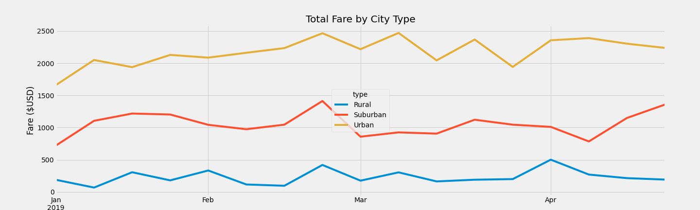
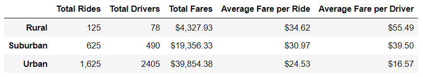

# PyBer_Analysis
## Overview of the analysis

### Purpose
In this study, we created a summary Dataframe and a multiple-line graph to illustrate the fare data among the three different city types: Rural, Suburban, and Urban. This data will be utilized to support recommendations to the CEO to improve disparities among the city types. 

## Results
Based on the multiple-line graph and summary Dataframe, Urban areas earn the most out of the three different city types. Although the average Fare per Ride is the lowest, the fare revenue is driven higher by the significantly higher number of rides and drivers. Interestingly, the Urban is the only city type that has more total drivers than total rides. Having higher supply (drivers) than demand (rides) would naturally cause the fare price to decrease. There are far fewer drivers in Rural and Suburban city types which helps explain why the fare prices are higher than the Urban city type. Having higher fare prices likely contributes to the lower number of rides in the Rural and Suburban city types. 

## Summary
 We recommend rolling out a program to encourage drivers in Urban areas to re-allocate to the two other city types. The program could offer current urban drivers bonus checks when completing rides in the other two city types. Having more drivers in the other city types, would drop the fare prices and encourage more riders which would increase the revenue.
 
 An additional recommendation is to roll out a program to encourage more riders in the Suburban and Rural city types. The program could offer riders a free first ride. More rides would increase the fare revenue and encourage more drivers in these areas.

 To encourage more riders in the Rural and Suburban areas, we recommend that Pyber partner with local businesses. For example, Pyber should connect bars and restaurants to collaborate. The collaboration could offer restaurant/bars and Pyber discount for riders that ride to or from the restaurant/bars. This collaborate could attract more customers for both the local business and Pyber.
